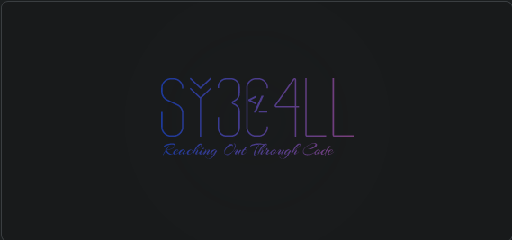

# sy3c4ll's profile

Welcome to my profile! I'm an open-source enthusiast and an all-rounder developer with a focus on Rust and systems programming. I'm deeply passionate about learning new technologies and pushing the boundaries of what's possible.

## About Me

- 🎓 Student and enthusiast programmer
- 🕊 Avid open-source proponent and sometimes contributor
- 💻 Arch Linux user (primarily CachyOS with COSMIC DE)
- ❤️ Interests: Systems Programming, Rust, Linux, and continuous learning
- 🌐 Languages I speak:
  - Fluent: English, Korean
  - Conversational: Japanese
  - Basic: French, German, Chinese

## Technical Skills

### Programming Languages

- Expert: Rust, C/C++, Python, Java
- Proficient: Go, Zig, Dart, Kotlin, Bash, Nushell
- Web Technologies: HTML/CSS/JavaScript

### Frameworks & Tools

- UI/Desktop: GTK, Qt, Iced, Flutter
- Game Development: Godot
- Web Development: NodeJS, NextJS, VanillaJS, Vite
- Documentation: Markdown, Typst
